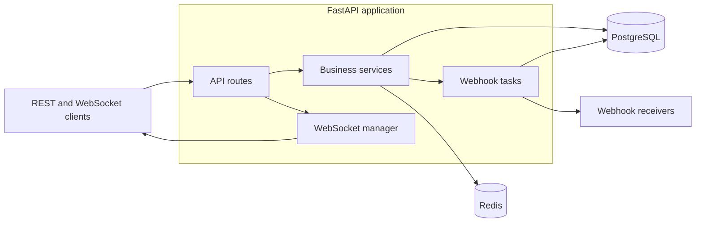

# TicketFlow Architecture

TicketFlow is a modular monolith built with FastAPI. PostgreSQL stores application data, Redis provides temporary caching, WebSockets send live notifications, and background tasks deliver outgoing webhooks.

## System Overview



Routes handle HTTP and WebSocket concerns. Services contain business rules and persistence logic. PostgreSQL is the source of truth; Redis and real-time delivery are supporting layers.

## Architecture Decisions

| Decision | Reason | Trade-off |
| --- | --- | --- |
| Modular monolith | The features share one domain and deployment, keeping development and transactions simple. | Components cannot be deployed or scaled independently without being separated later. |
| PostgreSQL as the source of truth | Tickets, users, comments, webhooks, and delivery logs need relational constraints and transactions. | Core operations depend on database availability. |
| Async FastAPI and SQLAlchemy | Database and network operations use one non-blocking programming model. | Async code is more involved than synchronous code. |
| Database-backed authorization | JWTs identify users, while the database supplies their current role. Customer ownership is enforced in ticket queries. | Protected requests require a user lookup. |
| Sequential ticket workflow | Status can only move `OPEN -> IN_PROGRESS -> RESOLVED -> CLOSED`. | Tickets cannot skip states or be reopened. |
| Versioned Redis keys | Incrementing `tickets:list:version` is O(1) and avoids matching-key deletion. | Old cache entries use memory until their TTL expires. |
| Redis graceful degradation | Cache errors are logged and reads fall back to PostgreSQL. | PostgreSQL receives more load during a Redis outage. |
| In-memory WebSocket manager | One API instance is sufficient for the assessment. | Multiple instances would require a shared event system. |
| Background webhook delivery | The ticket request does not wait for external endpoints. | Tasks are not durable and failed deliveries are not retried. |
| Recoverable webhook secrets | The original secret is required to sign later deliveries. | Production storage should encrypt these secrets at rest. |
| Webhook deactivation | Delivery logs retain their registration relationship for auditing. | Inactive registrations remain in the database. |

## Core Flows

### Authentication and authorization

Passwords are hashed with Argon2. Login returns signed access and refresh JWTs. Protected routes validate the access token, load the current user from PostgreSQL, and apply role checks.

Public registration always creates a customer. Agents can access all tickets; customers can access only tickets whose `customer_id` matches their user ID.

### Ticket changes

Database writes commit before any supporting side effects:

```text
validate request and lock an existing row when needed
-> update PostgreSQL
-> commit transaction
-> invalidate Redis cache
-> send any relevant WebSocket event
-> schedule any matching webhooks
```

For example, a status change locks the ticket, validates the next allowed status, commits the update, invalidates caches, broadcasts `ticket.status_changed`, and schedules matching webhooks. A Redis, WebSocket, or webhook failure cannot undo the committed database change.

### Webhook delivery

Agents can register endpoints for `ticket.created` and `ticket.status_changed`. TicketFlow serializes the event once, signs the exact request body with HMAC-SHA256, sends it with HTTPX, and records the result in `WebhookDeliveryLog`.

Delivery is successful only for a 2xx response. Network errors and non-2xx responses are stored as failures.

## Data and Caching

The main database entities are:

- `User`: identity, password hash, and role.
- `Ticket`: customer request, priority, category, status, and timestamps.
- `Comment`: immutable ticket message and author information.
- `WebhookRegistration`: endpoint, event, secret, and active state.
- `WebhookDeliveryLog`: payload and outcome of a delivery attempt.

Redis caches:

- Filtered ticket lists for 30 seconds.
- Agent dashboard statistics for 60 seconds.

Ticket-list keys include the cache version, caller scope, filters, and pagination. Customer-specific keys include the customer ID to prevent data leaking between users.

```text
tickets:list:v<version>:agent:<filter-hash>
tickets:list:v<version>:customer:<customer-id>:<filter-hash>
dashboard:stats
```

Ticket mutations increment the list version and delete the dashboard key. Old list entries become unreachable and expire through TTL. This avoids Redis `KEYS` and repeated `SCAN`-based deletion. Comments do not invalidate these caches because they do not change list fields or dashboard counts.

## Real-Time Events

WebSocket endpoints are notification-only:

```text
/ws/tickets/{ticket_id}?token=<access-token>
/ws/dashboard?token=<access-token>
```

Customers can subscribe only to their own tickets. Agents can subscribe to any ticket and the dashboard. Ticket subscribers receive `comment.created` and `ticket.status_changed`; dashboard subscribers receive both event types across all tickets. All mutations still use the REST API.

## Project Structure

```text
app/
|-- api/       routes and WebSocket endpoints
|-- core/      settings, security, and dependencies
|-- db/        async engine and sessions
|-- models/    SQLAlchemy models
|-- schemas/   request and response models
`-- services/  business rules and integrations
```

Alembic manages schema changes. Docker startup applies migrations, runs the idempotent development-agent seed, and then starts Uvicorn.

## Current Limitations

- WebSocket connections work across only one API process.
- Background webhook tasks have no durable queue or retry policy.
- `ILIKE` search has no relevance ranking.
- Refresh tokens cannot be individually revoked.
- Old versioned cache entries remain until their TTL expires.
- The repository does not yet include an automated test suite or CI workflow.

For production scaling, the first changes would be a shared WebSocket event bus, a durable webhook worker with retries, and encrypted webhook-secret storage.
